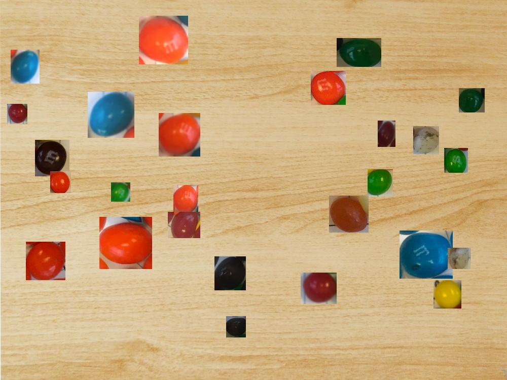

# Count candies

Image with candies to count:

Image with described candies:


### Approach described
The goal of the task is to classify and define polygons on the first image showing 4 different classes:
- M&Ms
- M&Ms with Peanuts
- Skittles
- Jelly Belly Beans (from Harry Potter)

This is typical object detection task, so I decided to use [yolov5](https://github.com/ultralytics/yolov5).

Since in the task there is just one more image, the one with candies described, I decided to use it as input data to
yolov5. Before moving to any complicated solutions, I checked if it would work to overfit yolov5 model on that input 
image and then use it to predict candies on the task image. In order to do so I have labeled second image using this
[online tool](https://www.makesense.ai/). It was easy to go through image, label candies and export it to format
acceptable by yolo.

Unfortunately this approach didn't work, not enough data for model to train and to learn anything. Since I have 
already labeled second image and that image is taken under similar conditions as the first one, I decided to use it 
further. 

The core of my approach is in generating synthetic data. I found an image of "similar" wooden table to the one in the
first image. Check it in folder [background](./background).

I also create a function/loop to export images and their masks, it can be found in 
[notebook](./explore_and_crop.ipynb) which I initially created to explore provided images. To create 
synthetic dataset, I reused most of the code from this 
[article](https://medium.com/@alexppppp/how-to-create-synthetic-dataset-for-computer-vision-object-detection-fd8ab2fa5249).

## Creating compositions of objects (candies) and backgrounds (wooden table)

### Objects and masks
Objects and masks have to be saved in separate folders, but with the same names. They should be named as: 
**class_name** + some_image_identificator  + image format extension.
E.g.: 4_image_3.png \
Script ``generate.py`` will use class names from filenames and generate yolo annotations according to them.

### CLI usage:
```bash
python entrypoint.py ARGUMENTS

ARGUMENTS:
--backgrounds_dir           
--compositions_dir
--objects_dir
--masks_dir
--yolo_labels_dir
--n_samples
```
Arguments are described in ``entrypoint.py`` help descriptions for each of them.

### Description of ``generate.py`` module
Iteratively takes random objects from ``--objects_dir`` and pastes them on random locations on the screenshot/background.
For each composition of the object and the background the mask will be made. For each mask, a .txt file is generated 
which has labels written in format required by yolo. Compositions of backgrounds and objects are saved in 
``--compositions_dir`` and yolo labels are saved in ``--yolo_labels_dir``.

### Example of generated synthetic image:

Belonging label in yolo format is this [file](./dataset/example_of_generated_dataset/eg.txt).

## Training the yolov5 model

I generated 500 compositions of background and images of candies. 50 of them were used for validation and the rest
for the training. \
**NOTE:** Since the yolov5 project is quite large and I didn't change anything related to the codebase, I
won't upload it as a part of this repo. It can be simply installed using pip (described in link mentioned above). \
The file that I provided to yolo where dataset is described is [candies_dataset.yaml](./candies_dataset.yaml).

Command used to train yolov5 model:
```bash
python train.py --img 1504 --batch 2 --epochs 40 --data *PROJECT_ROOT_DIR*/candies_dataset.yaml --weights yolov5s.pt --rect
```

Command used to predict with trained yolov5 model:
```bash
python detect.py --weights *PATH_TO_THE_BEST_WEIGHTS*/best.pt --source *PROJECT_ROOT_DIR*/candies_task.png \
--imgsz 1504 --save-txt --save-conf  
```

## Performance

Predictions show as (bounding_box + class_name + class_probability) for all classes and each class separately can be 
found in folder [predictions](./predictions).

For the given image, model has the worst performance for Jelly Belly Beans. It didn't recognize any of it. At the same
time it has a lot of predictions of MnM candies (both true and false positives). This is a good
sign that class distribution of synthetic dataset should be checked. Maybe there is too little images of 
Jelly Belly Beans and therefore model focused more on other classes/candies. Almost none of the predicted targets is 
without false positives or negatives. Since cropped images used in synthetic data generation include also background 
and parts of other candies, it for sure made model learn wrong features. It would be much better if there are cropped 
candies without any background.


## Metrics
To have concrete metrics, image to predict should be labeled. In that case it would be useful to calculate confusion 
matrix and extract number of false positives and negatives from it. Other useful metric would be mAP 
(mean Average Precision) and therefore all the metrics it consists of: IOU (Intersection Over Union), 
Precision, Recall, Precision Recall Curve and AP (Average Precision). mAP calculated on validation set during training
can be found in the folder [artifacts](./artifacts) together with the best model.

## Further improvements
### Dataset related
- remove background from images and masks with individual candies
- more balanced dataset (maybe even stratified sampling of classes?)
- use larger images as background? (closer to the size of image to predict)
- ...

### Model related
- try larger yolov5 pretrained models
- hyperparameter optimisation
- ablation study on different augmentation techniques, hyperparameters...
- ...

